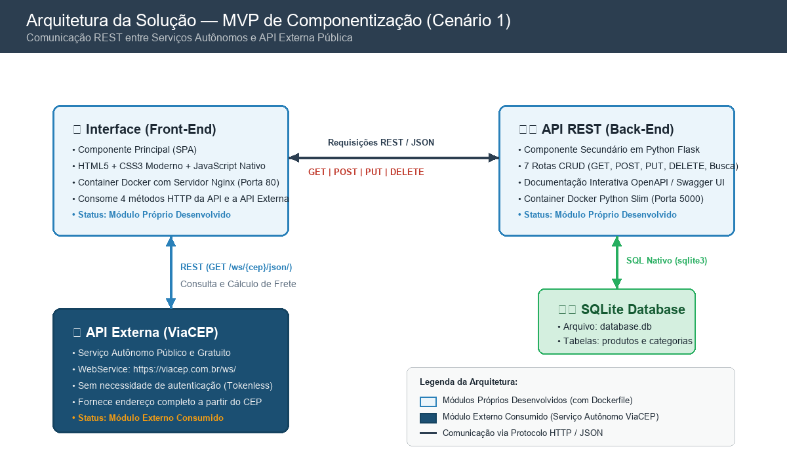

# Ferramentas WEB — Interface do Usuário (Front-End)

Este repositório contém a **Interface do Usuário (Componente Principal)** da solução **Ferramentas WEB**, desenvolvida para o **MVP de Componentização e Serviços Autônomos**. 

A aplicação é uma Single Page Application (SPA) moderna, responsiva e dinâmica construída em HTML5, CSS3 avançado e JavaScript nativo, projetada para gerenciar o catálogo de uma loja de ferramentas e interagir em tempo real com serviços autônomos.

---

## 1. Arquitetura da Solução (Cenário 1)

O sistema segue a arquitetura do **Cenário 1** do edital (Interface + Back-End + API Externa), operando com componentes autônomos desacoplados:



### Descrição dos Componentes e Comunicação:
1. **Componente Principal (Interface / Front-End):**
   - SPA servida via contêiner Nginx (porta 80).
   - Realiza chamadas assíncronas (`fetch`) para os **4 métodos HTTP** na API Back-End (`GET`, `POST`, `PUT`, `DELETE`).
   - Consome e trata dados do serviço externo autônomo (ViaCEP) diretamente na interface, sem qualquer redirecionamento de tela.
2. **Componente Secundário (API Back-End):**
   - Microsserviço REST em Python/Flask conteinerizado (porta 5000).
   - Gerencia a persistência no banco relacional SQLite (`database.db`) e fornece documentação interativa OpenAPI/Swagger UI.
3. **Componente Externo (ViaCEP WebService):**
   - API pública que fornece dados de endereço completos para simulação de frete e prazos de entrega regionais.

---

## 2. Chamadas HTTP Implementadas na Interface

Conforme exigido pelos critérios de avaliação, a interface do usuário consome a API através de 4 métodos HTTP distintos:

| Método | Endpoint | Descrição da Ação na Interface |
| :--- | :--- | :--- |
| **GET** | `/api/produtos` | Carrega e renderiza dinamicamente todas as ferramentas cadastradas no banco de dados. |
| **GET** | `/api/produtos/busca?nome=` | Realiza pesquisa textual dinâmica de ferramentas por termo no nome. |
| **POST** | `/api/produtos` | Formulário de cadastro de nova ferramenta (com validações de preço e categoria). |
| **PUT** | `/api/produtos/{id}` | Modal interativo de edição que permite atualizar nome, preço, categoria e descrição. |
| **DELETE** | `/api/produtos/{id}` | Botão de exclusão com diálogo de confirmação que remove a ferramenta do catálogo. |

---

## 3. Documentação da API Externa Utilizada

Para atender ao requisito de consumo de um serviço autônomo externo público e gratuito:

* **Nome do Serviço:** [ViaCEP WebService](https://viacep.com.br/)
* **URL Base:** `https://viacep.com.br/ws/`
* **Licença de Uso:** Aberta, gratuita e pública para uso geral no Brasil.
* **Necessidade de Cadastro:** **Não requer cadastro** nem chaves de autenticação (Tokenless).
* **Rota Utilizada:** `GET /ws/{cep}/json/`
* **Forma de Consumo e Tratamento:**
  - O usuário informa o CEP de destino no campo de simulação de frete.
  - A interface realiza a requisição via `fetch` diretamente para o ViaCEP.
  - Os dados retornados (`logradouro`, `bairro`, `localidade`, `uf`, `ddd`) são processados pelo JavaScript da aplicação.
  - Com base na UF (estado), a aplicação calcula automaticamente opções de frete (Envio Econômico PAC e Envio Expresso Sedex), exibindo os valores e prazos na tela **sem qualquer redirecionamento**.

---

## 4. Tecnologias Utilizadas

- **HTML5 Semântico:** Estruturação acessível e otimizada com tags semânticas e meta tags.
- **CSS3 Moderno:** Layout responsivo baseado em CSS Grid e Flexbox, variáveis customizadas, animações e toasts.
- **JavaScript (ES6+):** Lógica assíncrona com `async/await` e `fetch API`, manipulação dinâmica do DOM, máscaras de input e tratamento de erros.
- **Nginx (Alpine Linux):** Servidor web de alto desempenho para entrega dos arquivos estáticos em contêiner.
- **Docker & Docker Compose:** Containerização e orquestração do ambiente.

---

## 5. Como Executar a Aplicação

Você pode executar a interface localmente de forma direta ou utilizando o Docker.

### Pré-requisitos
- Navegador moderno (Google Chrome, Firefox, Microsoft Edge).
- [Docker Desktop](https://www.docker.com/products/docker-desktop/) instalado e ativo (para execução em contêiner).

---

### Opção A: Execução via Docker Compose (Recomendada)
O arquivo `docker-compose.yml` está disponibilizado na raiz deste componente para orquestrar a Interface e a API Back-End com um único comando:

```bash
# Na pasta Front_end (ou na raiz do projeto)
docker compose up --build
```

Após a inicialização:
- **Interface (Front-End):** acesse [http://localhost](http://localhost) (ou `http://localhost:80`)
- **API REST (Back-End):** acesse [http://localhost:5000/swagger](http://localhost:5000/swagger)

Para parar os serviços:
```bash
docker compose down
```

---

### Opção B: Execução com Docker Individual (Apenas o Front-End)

1. Construir a imagem Docker:
```bash
docker build -t frontend-app .
```

2. Executar o contêiner na porta 80:
```bash
docker run -d -p 80:80 --name frontend-container frontend-app
```

3. Acesse a aplicação em: `http://localhost:80`

Para parar o contêiner:
```bash
docker stop frontend-container
docker rm frontend-container
```

---

### Opção C: Execução Local Direta (Sem Docker)
1. Navegue até o diretório `Front_end`.
2. Dê um duplo clique no arquivo `index.html` ou abra com a extensão *Live Server* do VS Code.
*(Nota: Certifique-se de que a API Flask esteja em execução na porta 5000 para que as requisições HTTP funcionem).*

---

## 6. Estrutura de Pastas e Arquivos

```text
FRONT_END/
├── Dockerfile            # Configuração do contêiner Nginx para a SPA
├── .dockerignore         # Arquivos ignorados no build da imagem Docker
├── docker-compose.yml    # Orquestração do Front-End + Back-End
├── index.html            # Estrutura HTML5 da SPA com modais e seções
├── style.css             # Estilização completa, responsividade, temas e toasts
├── script.js             # Lógica de integração HTTP (GET, POST, PUT, DELETE) e ViaCEP
├── imagens/              # Recursos visuais da loja e diagrama de arquitetura
│   ├── arquitetura.png   # Fluxograma oficial da arquitetura do Cenário 1
│   ├── home.png          # Banner de entrada
│   ├── furadeira.png     # Imagem de ferramenta
│   ├── chave.png         # Imagem de ferramenta
│   ├── capacete.png      # Imagem de EPI
│   └── serra-circular.png# Imagem de ferramenta elétrica
└── README.md             # Esta documentação
```

---

## 7. Desenvolvedor
Projeto desenvolvido por **Matheus Lopes** para a disciplina de Desenvolvimento Full Stack.
